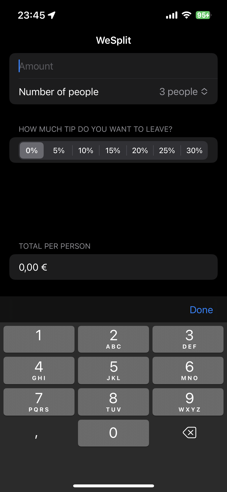
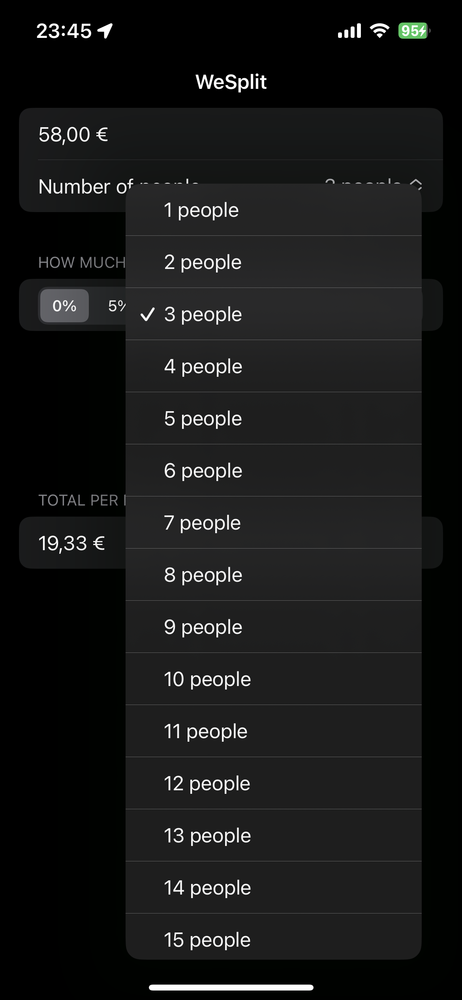

# WeSplit-SwiftUI
## Simple SwiftUI application for sharing bill costs including tips

- ### Application preview on the physical iOS device

- ### Setting value for bill amount

- ### Setting the number of people to whom the cost is shared

- ### Calculating the price per person

>I have learned how to use `Form`, `Section` and `Group` Views in SwiftUI. 

> Also worked with `@State` properties and user input in `TextField` View. 

> Learned how to use different types of `Picker`

> Fixed an issue with hiding the numeric keypad when the user wants to hide it
